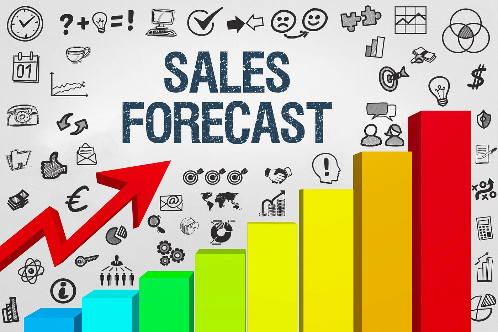

# Project Title 

Forecasting Store Sales for Improved Decision-Making Using Machine Learning for Time Series Data

## Project Overview
Accurate forecasting of sales is crucial for businesses across various industries as it provides several tangible benefits that contribute to improved decision-making and overall business performance. Some of the key ways in which accurate sales forecasting can positively impact a business include: Optimized inventory management; efficient allocation of resources such as human resources, production capacity, marketing budgets; Optimized production schedules; Effective marketing strategies; etc. 

The **AIM** of this project is to build a model that more accurately predicts the unit sales for thousands of items sold at different Favorita stores. 

Corporation Favorita is a large Ecuadorian-based grocery retailer

## Features

- Data Preprocessing
- Exploratory Data Analysis
- Modelling
- Model Evaluation
- Predictions
- Visualization
- PowerBI deployment 
- Sphinx documentation generator
- Code Structure: Cookiecutter data science. 

## Set-up and Installation

To set up the project locally and reproduce the results, follow the steps below:
First navigate to the directory to be used for the project, open the terminal(you can type "cmd" in the path bar to open terminal from the folder):

1. Create a new python virtual environment:

```console
python -m venv *venv_name*
```
2. Activate your *venv_name* :
```console
.\venv_name\Scripts\activate
```
3. clone project repo with git clone command

4. Install the dependencies in the requirement.txt
```console
(venv_name) pip install -r requirements.txt
```
5. Now you can experiment with the codes. Refer to the  *references directory* to understand folder struture. 


## Usage
To predict sales for a new horizon, follow the steps below:

# Example usage command


## Data 
Reach out at modelmaestrosolo@gmail.com for dataset. NB: dataset not uploaded to github due to size. both raw data and preprocessed data may be obtained
by sending me an email. 

## Technologies Used
List the main technologies, frameworks, and libraries used in your project.
- Programming Languages: Python, myst 
- Documentation tool: Sphinx
- Data analysis and manipulation: numpy, pandas
- statistical modelling: statsmodel 
- ML: Scikit-learn
- Data visualization: matplotlib, seaborn

## Contributing
Tietaar Louis, Brian Bassey, Umar Fawaz, Cornelius Cobbina. 

## License
This project is licensed under the MIT License.

## Article
Read an article on this project here: https://medium.com/@yebsolomon70/forecasting-store-sales-using-machine-learning-for-time-series-0a8d164b0626

## References
- Peng, R. D., & Matsui, E. (2015). The Art of Data Science. Skybrude Consulting, LLC

- vishwas, B. V., Patel A. (2020). Hands-on Time Series Analysis with Python. Apress
- [Kaggle Time Series Course](https://www.kaggle.com/learn/time-series)
